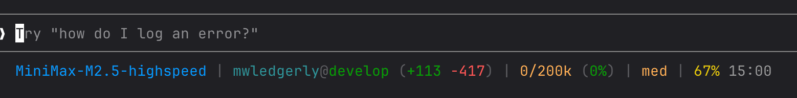

# Claude Code Status Line - MiniMax Version

自定义 Claude Code 状态栏，支持多 provider 用量感知显示。

## 功能

- **Model** - 当前模型名称
- **Provider** - CC-Switch 当前 provider 名称
- **CWD@Branch** - 当前目录和 Git 分支（含变更统计）
- **Tokens** - 已用 Token 数量和百分比
- **Effort** - 推理强度（low/med/high）
- **Usage** - Provider 专属用量（根据 CC-Switch 配置自动适配）

## 用量显示（按 provider 自动切换）

| Provider | 用量来源 | 显示内容 |
|----------|---------|---------|
| Github | localhost:4141/usage | Premium 配额 + 重置日期 |
| MiniMax | MiniMax API | 当前区间用量 + 剩余时间 |
| 其他 | — | 不显示用量 |

## 效果预览



## 安装

### 1. 下载脚本

```bash
curl -o ~/.claude/statusline-minimax.sh https://raw.githubusercontent.com/leo2dev/claude-code-statusline-minimax/main/statusline-minimax.sh
chmod +x ~/.claude/statusline-minimax.sh
```

### 2. 配置 Claude Code

编辑 `~/.claude/settings.json`，添加：

```json
{
  "statusLine": {
    "type": "command",
    "command": "~/.claude/statusline-minimax.sh"
  }
}
```

### 3. 重启 Claude Code

## 依赖

- `jq` - JSON 解析
- `curl` - API 请求
- `sqlite3` - 读取 CC-Switch 配置
- Git（用于显示分支信息）

## 兼容性

- macOS / Linux
- Claude Code
- 需要安装 [CC-Switch](https://github.com) 并配置 provider
- 不同 provider 需要对应 API 权限：
  - Github: 需要本地代理（如 CC-Switch 内置的 4141 端口）
  - MiniMax: 需要 MiniMax API Key 并在 CC-Switch 中配置

## 扩展新 Provider

在 `statusline-minimax.sh` 的 `case "$provider_name"` 块中添加新的 provider 分支即可。

## 许可证

MIT
